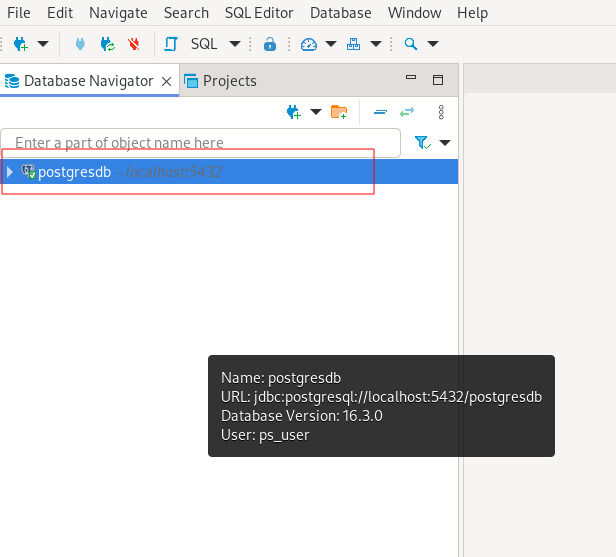

# Database optionals

## Configure a SQL client: DBeaver

Install [DBeaver Community](https://dbeaver.io/).

### Configure DBeaver
1. Create a port-forward in a new terminal tab.
  ```bash
  $ kubectl port-forward -n [namespace] svc/postgres 5432:5432
  ```
1. DBeaver settings.
  * Go to `Database` > `New Database Connection`. Select `PostgreSQL`.
    Fill the connection parameters with the values from `ps-secret.yaml`. 
    Click on the `Finish` button.

    

  * Click right on the new database connection and click on `Connect`. 
    The check symbol will change from grey to green to indicate that the client is connected to the database.

    

  * Click on the drop down to navigate the database.
    
    

## SQL Queries (Examples)
These queries can be executed from the database.
Connect to the database.
```bash
$ kubectl exec -it [postgres_pod] -n [namespace] -- psql -h localhost -U [db_user] --password -p 5432 [db_name]
```
```sql
SELECT * FROM test_objects;
```
```sql
SELECT * FROM test_objects WHERE kind='Job';
```
```sql
SELECT * FROM test_objects WHERE data::jsonb->>'kind'='Job';
```