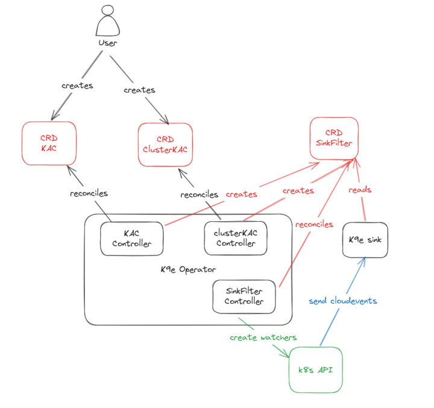

= KubeArchive Operator Design

The KubeArchive Operator manages the lifecycle of KubeArchive components and configurations through custom resource definitions (CRDs) and their associated controllers. This document provides comprehensive technical documentation for the operator's types and controllers.

== Overview

The operator is built using the Kubebuilder framework and follows the Kubernetes controller pattern. It manages five core custom resource types through three specialized controllers, enabling automated configuration management, resource archiving, and cleanup operations.

**API Group:** `kubearchive.org/v1`

.Operator Overview

== Custom Resource Types

=== Core Configuration Types

==== KubeArchiveConfig

*Scope:* Namespaced +
*Short Names:* `kac`, `kacs` +
*GVR:* `kubearchive.org/v1/kubearchiveconfigs`

The `KubeArchiveConfig` resource defines namespace-scoped archiving rules for Kubernetes resources. It specifies which resources should be archived, when they should be archived, and deletion policies.

[source,go]
----
type KubeArchiveConfigSpec struct {
    Resources []KubeArchiveConfigResource `json:"resources" yaml:"resources"`
}

type KubeArchiveConfigResource struct {
    Selector        APIVersionKindSelector `json:"selector,omitempty"`
    ArchiveWhen     string                 `json:"archiveWhen,omitempty"`
    DeleteWhen      string                 `json:"deleteWhen,omitempty"`
    ArchiveOnDelete string                 `json:"archiveOnDelete,omitempty"`
}
----

**Fields:**

* `spec.resources[]` - Array of resource configuration rules
* `spec.resources[].selector` - Specifies the Kubernetes resource type (APIVersion + Kind)
* `spec.resources[].archiveWhen` - CEL expression defining when to archive the resource
* `spec.resources[].deleteWhen` - CEL expression defining when to delete the resource from the cluster
* `spec.resources[].archiveOnDelete` - CEL expression defining archival behavior on resource deletion

**Example:**
[source,yaml]
----
apiVersion: kubearchive.org/v1
kind: KubeArchiveConfig
metadata:
  name: kubearchive
  namespace: production
spec:
  resources:
  - selector:
      apiVersion: v1
      kind: Pod
    archiveWhen: "true"
    deleteWhen: "object.status.phase == 'Succeeded'"
----

==== ClusterKubeArchiveConfig

*Scope:* Cluster +
*Short Names:* `ckac`, `ckacs` +
*GVR:* `kubearchive.org/v1/clusterkubearchiveconfigs`

The `ClusterKubeArchiveConfig` resource provides cluster-wide archiving rules that apply globally across all namespaces. It uses the same spec structure as `KubeArchiveConfig` but operates at the cluster level.

[source,go]
----
type ClusterKubeArchiveConfigSpec KubeArchiveConfigSpec
----

This type inherits all functionality from `KubeArchiveConfig` but has cluster-wide scope, making it suitable for global policies that should apply across all namespaces.

==== SinkFilter

*Scope:* Namespaced +
*Short Names:* `sf`, `sfs` +
*GVR:* `kubearchive.org/v1/sinkfilters`

The `SinkFilter` resource controls dynamic Kubernetes resource watching and CloudEvent generation. It defines which resources should be monitored in specified namespaces and automatically creates watches for those resources.

[source,go]
----
type SinkFilterSpec struct {
    Namespaces map[string][]KubeArchiveConfigResource `json:"namespaces" yaml:"namespaces"`
}
----

**Fields:**

* `spec.namespaces` - Map of namespace names to resource configurations
* Each namespace entry contains an array of `KubeArchiveConfigResource` definitions

**Example:**
[source,yaml]
----
apiVersion: kubearchive.org/v1
kind: SinkFilter
metadata:
  name: sink-filters
  namespace: kubearchive
spec:
  namespaces:
    "production":
    - selector:
        apiVersion: v1
        kind: Pod
    - selector:
        apiVersion: apps/v1
        kind: Deployment
    "___global___":
    - selector:
        apiVersion: v1
        kind: ConfigMap
----

NOTE: The special namespace `___global___` indicates cluster-wide resource monitoring.

=== Vacuum Configuration Types

==== NamespaceVacuumConfig

*Scope:* Namespaced +
*Short Names:* `nvc`, `nvcs` +
*GVR:* `kubearchive.org/v1/namespacevacuumconfigs`

The `NamespaceVacuumConfig` resource defines cleanup operations for archived resources within a specific namespace. It specifies which resource types should be subject to vacuum (cleanup) operations.

[source,go]
----
type NamespaceVacuumConfigSpec struct {
    Resources []APIVersionKind `json:"resources,omitempty" yaml:"resources"`
}
----

**Fields:**

* `spec.resources[]` - Array of resource types (APIVersion + Kind) to include in vacuum operations

**Example:**
[source,yaml]
----
apiVersion: kubearchive.org/v1
kind: NamespaceVacuumConfig
metadata:
  name: vacuum-config
  namespace: production
spec:
  resources:
  - apiVersion: v1
    kind: Pod
  - apiVersion: batch/v1
    kind: Job
----

==== ClusterVacuumConfig

*Scope:* Namespaced +
*Short Names:* `cvc`, `cvcs` +
*GVR:* `kubearchive.org/v1/clustervacuumconfigs`

The `ClusterVacuumConfig` resource manages vacuum operations across multiple namespaces from a central configuration. Despite being namespaced for RBAC purposes, it can operate on resources across different namespaces.

[source,go]
----
type ClusterVacuumConfigSpec struct {
    Namespaces map[string]ClusterVacuumConfigNamespaceSpec `json:"namespaces,omitempty" yaml:"namespaces"`
}

type ClusterVacuumConfigNamespaceSpec struct {
    NamespaceVacuumConfigSpec `json:",inline,omitempty"`
}
----

**Fields:**

* `spec.namespaces` - Map of namespace names to their vacuum configurations
* Each namespace configuration embeds `NamespaceVacuumConfigSpec`

**Example:**
[source,yaml]
----
apiVersion: kubearchive.org/v1
kind: ClusterVacuumConfig
metadata:
  name: cluster-vacuum
  namespace: kubearchive
spec:
  namespaces:
    "production":
      resources:
      - apiVersion: v1
        kind: Pod
    "staging":
      resources:
      - apiVersion: batch/v1
        kind: Job
----

== Controllers

The operator implements three specialized controllers that manage the lifecycle and behavior of the custom resources.

=== KubeArchiveConfigReconciler

**Manages:** `KubeArchiveConfig` resources +
**Scope:** Namespace-specific configuration management

The `KubeArchiveConfigReconciler` is responsible for managing namespace-scoped archiving configurations. It handles the creation, update, and deletion of resources required for archiving operations within specific namespaces.

==== Core Responsibilities

1. **Resource Lifecycle Management**
   - Creates and manages ServiceAccounts for archiving operations
   - Manages RBAC permissions (Roles and RoleBindings) for resource access
   - Handles finalizers to ensure clean resource cleanup

2. **Configuration Validation**
   - Validates CEL expressions in resource configurations
   - Ensures proper APIVersion and Kind selectors
   - Validates resource access permissions

3. **SinkFilter Generation**
   - Automatically creates or updates `SinkFilter` resources based on `KubeArchiveConfig` specifications
   - Manages the mapping between archive configurations and resource watching

==== RBAC Permissions

The controller requires extensive RBAC permissions to manage resources:

[source,go]
----
//+kubebuilder:rbac:groups=kubearchive.org,resources=clustervacuums;kubearchiveconfigs;namespacevacuums;sinkfilters,verbs=get;list;watch;create;update;patch;delete
//+kubebuilder:rbac:groups=kubearchive.org,resources=kubearchiveconfigs/status,verbs=get;update;patch
//+kubebuilder:rbac:groups=kubearchive.org,resources=kubearchiveconfigs/finalizers,verbs=update
//+kubebuilder:rbac:groups=core,resources=serviceaccounts,verbs=create;delete;get;list;update;watch
//+kubebuilder:rbac:groups=rbac.authorization.k8s.io,resources=clusterrolebindings;clusterroles;roles;rolebindings,verbs=bind;create;delete;escalate;get;list;update;watch
//+kubebuilder:rbac:groups="",resources=namespaces,verbs=get;list;update;watch
----

==== Reconciliation Logic

1. **Resource Retrieval:** Fetches the `KubeArchiveConfig` resource
2. **Finalizer Management:** Adds or processes finalizers for cleanup
3. **Resource Creation:** Creates necessary ServiceAccounts and RBAC resources
4. **SinkFilter Management:** Updates `SinkFilter` configurations
5. **Status Updates:** Updates resource status to reflect current state

=== ClusterKubeArchiveConfigReconciler

**Manages:** `ClusterKubeArchiveConfig` resources +
**Scope:** Cluster-wide configuration management

The `ClusterKubeArchiveConfigReconciler` manages cluster-scoped archiving configurations. It provides similar functionality to the namespace-scoped controller but operates at the cluster level.

==== Core Responsibilities

1. **Cluster-wide Policy Management**
   - Manages global archiving policies that apply across all namespaces
   - Creates cluster-level RBAC resources (ClusterRoles and ClusterRoleBindings)
   - Handles cluster-scoped ServiceAccount management

2. **Global SinkFilter Coordination**
   - Updates `SinkFilter` resources with cluster-wide resource monitoring requirements
   - Manages the special `___global___` namespace designation for cluster resources

3. **Namespace Integration**
   - Coordinates with namespace-specific configurations
   - Provides fallback policies for namespaces without specific configurations

==== RBAC Permissions

[source,go]
----
//+kubebuilder:rbac:groups=kubearchive.org,resources=clusterkubearchiveconfigs;clustervacuums;namespacevacuums;sinkfilters,verbs=get;list;watch;create;update;patch;delete
//+kubebuilder:rbac:groups=kubearchive.org,resources=clusterkubearchiveconfigs/status,verbs=get;update;patch
//+kubebuilder:rbac:groups=kubearchive.org,resources=clusterkubearchiveconfigs/finalizers,verbs=update
//+kubebuilder:rbac:groups=core,resources=serviceaccounts,verbs=create;delete;get;list;update;watch
//+kubebuilder:rbac:groups=rbac.authorization.k8s.io,resources=clusterrolebindings;clusterroles;roles;rolebindings,verbs=bind;create;delete;escalate;get;list;update;watch
//+kubebuilder:rbac:groups="",resources=namespaces,verbs=get;list;update;watch
----

=== SinkFilterReconciler

**Manages:** `SinkFilter` resources +
**Scope:** Dynamic resource watching and CloudEvent generation

The `SinkFilterReconciler` is the most complex controller, responsible for dynamically creating and managing Kubernetes resource watches based on `SinkFilter` configurations. It implements a sophisticated watch management system that scales efficiently with large numbers of resources.

==== Core Responsibilities

1. **Dynamic Watch Management**
   - Creates Kubernetes watches for specified resource types and namespaces
   - Manages watch lifecycle including creation, updates, and cleanup
   - Handles watch reconnection and error recovery

2. **CloudEvent Generation**
   - Converts Kubernetes watch events into CloudEvents
   - Sends CloudEvents to the sink service for processing
   - Manages event routing and delivery

3. **Resource Monitoring**
   - Monitors resource changes across multiple namespaces
   - Filters events based on namespace and resource type configurations
   - Tracks resource versions for efficient watch resumption

==== Architecture Components

===== WatchInfo Structure

[source,go]
----
type WatchInfo struct {
    GVR             schema.GroupVersionResource
    KindSelector    sourcesv1.APIVersionKindSelector
    Namespaces      map[string]struct{}
    StopCh          chan struct{}
    WatchInterface  watch.Interface
    ResourceVersion string
}
----

**Fields:**

* `GVR` - GroupVersionResource for the watched resource type
* `KindSelector` - APIVersion and Kind specification
* `Namespaces` - Set of namespaces this watch monitors
* `StopCh` - Channel for signaling watch termination
* `WatchInterface` - Active Kubernetes watch interface
* `ResourceVersion` - Last processed resource version for efficient resumption

===== Watch Management

The controller maintains a thread-safe map of active watches:

[source,go]
----
type SinkFilterReconciler struct {
    // ... other fields
    mu      sync.RWMutex
    watches map[string]*WatchInfo
}
----

==== Watch Lifecycle Management

1. **Watch Generation**
   - `generateWatches()` analyzes `SinkFilter` specifications
   - Determines which watches to start, stop, or update
   - Uses set operations to efficiently calculate watch changes

2. **Watch Creation**
   - `createWatchForGVR()` initializes new watches
   - Sets up proper resource version tracking
   - Starts background watch processing goroutines

3. **Watch Processing**
   - `watchLoop()` manages individual watch connections
   - Implements exponential backoff for failed connections
   - Handles watch disconnections and reconnections

4. **Event Processing**
   - `processWatchEvents()` processes incoming watch events
   - Handles error events and resource version updates
   - Routes events to CloudEvent generation

===== Error Handling

The controller implements sophisticated error handling:

* **Watch Errors:** `logWatchError()` logs detailed error information
* **Resource Version Management:** `shouldClearResourceVersion()` determines when to reset resource versions
* **Connection Recovery:** Automatic reconnection with exponential backoff
* **Status Code Handling:** Proper HTTP status code interpretation (e.g., 410 Gone)

==== CloudEvent Integration

The controller integrates with the CloudEvent system:

1. **Event Generation**
   - Converts Kubernetes watch events to CloudEvents
   - Sets appropriate event types (add, update, delete)
   - Includes resource metadata as CloudEvent extensions

2. **Event Delivery**
   - Uses `SinkCloudEventPublisher` for event delivery
   - Targets the sink service directly
   - Handles delivery acknowledgments and errors

3. **Event Types**
   - `org.kubearchive.sinkfilters.resource.add`
   - `org.kubearchive.sinkfilters.resource.update`
   - `org.kubearchive.sinkfilters.resource.delete`

==== RBAC Permissions

[source,go]
----
//+kubebuilder:rbac:groups=kubearchive.org,resources=sinkfilters,verbs=get;list;watch;create;update;patch;delete
//+kubebuilder:rbac:groups=kubearchive.org,resources=sinkfilters/status,verbs=get;update;patch
//+kubebuilder:rbac:groups=kubearchive.org,resources=sinkfilters/finalizers,verbs=update
//+kubebuilder:rbac:groups="*",resources="*",verbs=get;list;watch
//+kubebuilder:rbac:groups=kubearchive.org,resources=kubearchiveconfigs;clusterkubearchiveconfigs,verbs=get;list;watch
----

== Operator Configuration

The operator can be configured through a ConfigMap that controls operational parameters such as the number of worker threads allocated to process events for each resource type.

=== Configuration ConfigMap

**Name:** `kubearchive-operator` +
**Namespace:** `kubearchive` +
**Mount Path:** `/etc/kubearchive/config/resources.yaml`

The configuration is provided as a YAML list under the `resources.yaml` key in the ConfigMap. Each entry defines the worker count for a specific resource type.

==== Configuration Structure

[source,yaml]
----
apiVersion: v1
kind: ConfigMap
metadata:
  name: kubearchive-operator
  namespace: kubearchive
data:
  resources.yaml: |
    - selector:
        kind: "--all--"
        apiVersion: "--all--"
      workers: 3
    - selector:
        kind: "Pod"
        apiVersion: "v1"
      workers: 5
    - selector:
        kind: "Deployment"
        apiVersion: "apps/v1"
      workers: 2
----

==== Configuration Fields

* `selector.kind` - The Kubernetes resource Kind
* `selector.apiVersion` - The API version for the resource
* `workers` - Number of worker goroutines to spawn for processing events for this resource type

==== Default Configuration

The special selector with `kind: "--all--"` and `apiVersion: "--all--"` serves as the default configuration. Any resource type that doesn't have a specific configuration entry will use this default. The operator ships with a default configuration of 3 workers for all resources.

==== Worker Behavior

Workers are responsible for:

* Processing watch events from the workqueue
* Evaluating CEL expressions for archival and deletion conditions
* Generating and sending CloudEvents to the sink service
* Handling transient errors with rate limiting

The number of workers directly impacts throughput for each resource type. Resources with high event rates may benefit from more workers, while less active resources can use fewer workers to conserve system resources.

==== Configuration Loading

The configuration is loaded once during operator startup from the mounted ConfigMap. To apply configuration changes, the operator pod must be restarted.

== Best Practices

=== Resource Configuration

1. **CEL Expressions:** Use efficient CEL expressions in `archiveWhen` and `deleteWhen` conditions
2. **Namespace Organization:** Group related resources in the same namespace configurations
3. **Global vs. Local:** Use cluster-scoped resources for organization-wide policies

=== Performance Optimization

1. **Watch Efficiency:** Minimize the number of resource types being watched
2. **Namespace Filtering:** Use specific namespace configurations rather than global watches when possible
3. **Resource Version Tracking:** The controller automatically optimizes watch resumption
4. **Worker Configuration:** Adjust the number of workers per resource type based on event volume
   - High-traffic resources (e.g., Pods, Events) may benefit from more workers
   - Low-traffic resources can use fewer workers to conserve resources
   - Start with the default (3 workers) and tune based on observed performance

=== Security Considerations

1. **RBAC Principle:** The operator follows least-privilege RBAC principles
2. **Service Account Management:** Dedicated service accounts for different operations
3. **Finalizer Handling:** Proper cleanup through finalizer management

== Troubleshooting

=== Common Issues

1. **Watch Failures:** Check RBAC permissions for resource access
2. **CloudEvent Delivery:** Verify sink service availability and network connectivity
3. **Resource Version Conflicts:** The controller automatically handles these through error recovery

=== Monitoring

* **Log Analysis:** Controllers provide structured logging for debugging
* **Metrics:** Integration with OpenTelemetry for operational metrics
* **Status Resources:** Resource status fields provide operational state information

== Future Considerations

The operator architecture is designed for extensibility:

* **Additional Resource Types:** Easy addition of new CRD types
* **Enhanced Filtering:** Support for more complex resource selection criteria
* **Observability Integration:** Enhanced metrics and tracing capabilities
* **Multi-cluster Support:** Potential for cross-cluster resource archiving
