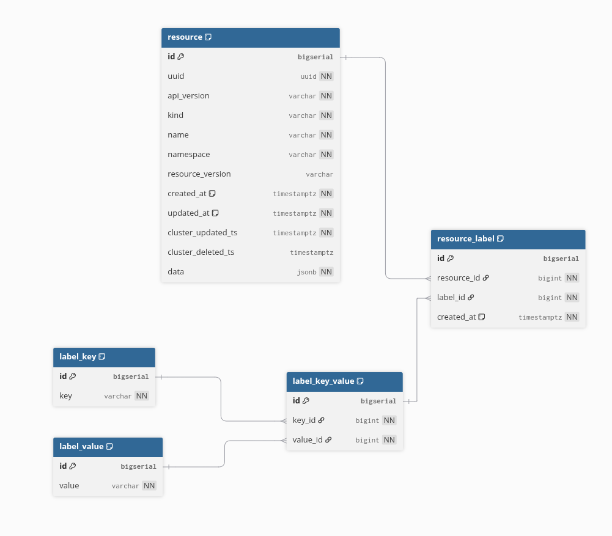

= PostgreSQL Label Filtering

== Overview

This page documents the PostgreSQL-specific implementation of label filtering
using normalized relational tables.

=== Motivation

The initial implementation stored Kubernetes resource labels exclusively in JSONB
fields within the `resource` table.
While JSONB provides flexibility and keeps the full resource manifest intact,
querying by labels using JSONB operations had severe performance limitations:

* **Query Performance**: Performance degraded significantly as the number of
  resources grew when label filters were applied that were not selective enough
* **Index Limitations**: GIN indexes on JSONB fields are less efficient for
  complex label selector queries with low selectivity
* **Query Complexity**: Multiple label conditions required expensive JSONB path
  operations for each row

To achieve better query performance for label selector queries, we implemented
a normalized relational schema that duplicates labels from JSONB into dedicated
indexed tables.

=== Design Goals

* Maintain backward compatibility - keep JSONB `data` field unchanged for full
  manifest storage
* Improve query performance for label selectors, especially those with low
  selectivity on large datasets
* Support all Kubernetes label selector operations: `exists`, `notexists`,
  `equals`, `notequals`, `in`, `notin`
* Avoid updating label tables when resource updates don't affect labels
  (e.g., status-only updates), preventing unnecessary table locking and write
  operations
* Avoid querying the database for previous resource state and deserializing it
  just to determine if label updates are needed
* Deduplicate label keys, values, and key-value pairs to minimize storage
  overhead
* Immutable label tables to prevent accidental modifications (UPDATE operations
  are revoked)
* Minimize timestamp overhead - only `resource_label` has `created_at` for
  troubleshooting

== Normalized Schema

The label normalization uses a 4-table design to minimize storage and maximize
query performance:

Key relationships:

* Each **resource** can have multiple **resource_label** entries (one per label)
* Each **resource_label** references one **label_key_value** (the key-value combination)
* Each **label_key_value** references one **label_key** and one **label_value**
* Keys, values, and pairs are deduplicated - stored once and reused across all
  resources

== Query Implementation

=== Interface Changes

The label filtering implementation required changes to the `DBFilter` interface
to support pre-resolved ID lookups:

Previously, each label filter type was implemented as separate methods that
returned SQL expressions:
[source,go]
----
existsLabelFilter(cond sqlbuilder.Cond, labels []string) string
equalsLabelFilter(cond sqlbuilder.Cond, labels map[string]string) string
// ... etc
----

The current approach consolidates all label filtering into a single method that
pre-resolves label strings to integer IDs before building the main query:
[source,go]
----
ApplyLabelFilters(ctx context.Context, querier sqlx.QueryerContext, sb *sqlbuilder.SelectBuilder, labelFilters *models.LabelFilters) error
----

**Rationale**: Label filtering with normalized tables requires correlated
subqueries that must be coordinated with the main query structure.
The consolidated method can:

* Pre-resolve label key names and key-value pairs to integer IDs via indexed
  lookups, enabling the PostgreSQL planner to use MCV (Most Common Value)
  statistics for accurate row count estimates
* Apply EXISTS subqueries for positive label conditions using pre-resolved IDs
* Apply NOT EXISTS subqueries for negative label conditions using pre-resolved IDs
* Short-circuit with `WHERE 1=0` when a required key or pair does not exist
  in the database
* Skip negative filters when the excluded key or pair does not exist (trivially
  true)

=== Query Strategy

Label filters are applied in two phases:

**Phase 1: ID Resolution** - Before building the main SQL query, label key
names and key-value pairs are resolved to their integer IDs via batch lookups:

* `resolveKeyIDs` - resolves key names to `label_key.id` using
  `SELECT id, key FROM label_key WHERE key IN (...)`
* `resolvePairIDs` - resolves key=value pairs to `label_key_value.id` using
  a tuple `IN` clause with JOINs
* `resolvePairIDsMulti` - same as above but for keys with multiple values
  (In/NotIn operators)

**Phase 2: Query Building** - The pre-resolved integer IDs are passed as
parameter constants in the main query. Because these are constant values known
at plan time, the PostgreSQL planner can look up MCV statistics and produce
accurate row count estimates, leading to optimal query plans.

All label filters use correlated `EXISTS` / `NOT EXISTS` subqueries with
pre-resolved IDs, eliminating most JOINs inside the subqueries.
Each filter is applied as an independent subquery, and multiple filters are
combined with `AND`.
This gives the query planner full optimization flexibility: it can reorder
conditions based on table statistics, short-circuit evaluation, and plan each
subquery independently.

=== Edge Case Handling

[cols="1,2,2", options="header"]
|===
| Scenario | Positive filters (Exists/Equals/In) | Negative filters (NotExists/NotEquals/NotIn)

| Key not in DB
| Short-circuit: add `WHERE 1=0`, return early
| No-op: condition trivially true, skip

| Pair not in DB
| Short-circuit: add `WHERE 1=0`, return early
| No-op: nothing to exclude, skip
|===

=== Query Examples

==== Example 1: Single Exists Filter

**Label Selector**: `env` (select resources that have the label key `env`)

**Resolution Query**:
[source,sql]
----
SELECT id, key FROM label_key WHERE key IN ($1)  -- $1 = 'env', returns e.g. id=42
----

**Generated Query**:
[source,sql]
----
SELECT
    resource.data->'metadata'->>'creationTimestamp' AS created_at,
    resource.id,
    resource.uuid,
    resource.data
FROM resource
WHERE EXISTS (
    SELECT 1
    FROM resource_label rl
    JOIN label_key_value lkv ON lkv.id = rl.label_id
    WHERE rl.resource_id = resource.id
    AND lkv.key_id = $1  <1>
)
----
<1> `$1 = 42` (pre-resolved key ID) - Single JOIN, no string comparison

==== Example 2: Single Equals Filter

**Label Selector**: `env=prod` (select resources where label `env` equals `prod`)

**Resolution Query**:
[source,sql]
----
SELECT lkv.id, lk.key, lv.value
FROM label_key_value lkv
JOIN label_key lk ON lk.id = lkv.key_id
JOIN label_value lv ON lv.id = lkv.value_id
WHERE (lk.key, lv.value) IN (($1, $2))  -- returns e.g. id=57
----

**Generated Query**:
[source,sql]
----
SELECT
    resource.data->'metadata'->>'creationTimestamp' AS created_at,
    resource.id,
    resource.uuid,
    resource.data
FROM resource
WHERE EXISTS (
    SELECT 1
    FROM resource_label rl
    WHERE rl.resource_id = resource.id
    AND rl.label_id = $1  <1>
)
----
<1> `$1 = 57` (pre-resolved pair ID) - Zero JOINs, single-table lookup on
  `resource_label`

==== Example 3: Single In Filter

**Label Selector**: `env in (prod, stage)` (select resources where label `env`
is either `prod` or `stage`)

**Generated Query**:
[source,sql]
----
SELECT
    resource.data->'metadata'->>'creationTimestamp' AS created_at,
    resource.id,
    resource.uuid,
    resource.data
FROM resource
WHERE EXISTS (
    SELECT 1
    FROM resource_label rl
    WHERE rl.resource_id = resource.id
    AND rl.label_id IN ($1, $2)  <1>
)
----
<1> `$1 = 57`, `$2 = 58` (pre-resolved pair IDs for env=prod and env=stage) -
  Zero JOINs

==== Example 4: Single NotExists Filter

**Label Selector**: `!env` (select resources that do NOT have the label key `env`)

**Generated Query**:
[source,sql]
----
SELECT
    resource.data->'metadata'->>'creationTimestamp' AS created_at,
    resource.id,
    resource.uuid,
    resource.data
FROM resource
WHERE NOT EXISTS (
    SELECT 1
    FROM resource_label rl
    JOIN label_key_value lkv ON lkv.id = rl.label_id
    WHERE rl.resource_id = resource.id
    AND lkv.key_id IN ($1)  <1>
)
----
<1> `$1 = 42` (pre-resolved key ID) - One JOIN

==== Example 5: Single NotEquals Filter

**Label Selector**: `env!=prod` (select resources where label `env` exists but
does NOT equal `prod`)

**Generated Query**:
[source,sql]
----
SELECT
    resource.data->'metadata'->>'creationTimestamp' AS created_at,
    resource.id,
    resource.uuid,
    resource.data
FROM resource
WHERE NOT EXISTS (
    SELECT 1
    FROM resource_label rl
    WHERE rl.resource_id = resource.id
    AND rl.label_id IN ($1)  <1>
)
----
<1> `$1 = 57` (pre-resolved pair ID for env=prod) - Zero JOINs

==== Example 6: Single NotIn Filter

**Label Selector**: `env notin (prod, stage)` (select resources where label
`env` exists but is NOT `prod` or `stage`)

**Generated Query**:
[source,sql]
----
SELECT
    resource.data->'metadata'->>'creationTimestamp' AS created_at,
    resource.id,
    resource.uuid,
    resource.data
FROM resource
WHERE EXISTS (
    SELECT 1
    FROM resource_label rl
    JOIN label_key_value lkv ON lkv.id = rl.label_id
    WHERE rl.resource_id = resource.id
    AND lkv.key_id IN ($1)  <1>
    GROUP BY rl.resource_id
    HAVING COUNT(DISTINCT lkv.key_id) = 1
)
AND NOT EXISTS (
    SELECT 1
    FROM resource_label rl
    WHERE rl.resource_id = resource.id
    AND rl.label_id IN ($2, $3)  <2>
)
----
<1> `$1 = 42` (pre-resolved key ID for `env`) - Ensure the key exists
<2> `$2 = 57`, `$3 = 58` (pre-resolved pair IDs for env=prod and env=stage) -
  Exclude forbidden pairs, zero JOINs

==== Example 7: Two Equals Filters

**Label Selector**: `app=frontend,env=prod` (select resources where label `app`
equals `frontend` AND label `env` equals `prod`)

**Generated Query**:
[source,sql]
----
SELECT
    resource.data->'metadata'->>'creationTimestamp' AS created_at,
    resource.id,
    resource.uuid,
    resource.data
FROM resource
WHERE EXISTS (
    SELECT 1
    FROM resource_label rl
    WHERE rl.resource_id = resource.id
    AND rl.label_id = $1  <1>
)
AND EXISTS (
    SELECT 1
    FROM resource_label rl
    WHERE rl.resource_id = resource.id
    AND rl.label_id = $2  <2>
)
----
<1> `$1 = 100` (pre-resolved pair ID for app=frontend)
<2> `$2 = 101` (pre-resolved pair ID for env=prod)

**Logic**: Each key-value pair is resolved to its pair ID.
Each pair gets its own independent EXISTS subquery with zero JOINs.

==== Example 8: Combined Filters (Positive and Negative)

**Label Selector**: `env in (prod, stage), app=frontend, !debug`

This selector combines multiple filter types:
* `app=frontend` - Equals filter (positive)
* `env in (prod, stage)` - In filter (positive)
* `!debug` - NotExists filter (negative)

**Generated Query**:
[source,sql]
----
SELECT
    resource.data->'metadata'->>'creationTimestamp' AS created_at,
    resource.id,
    resource.uuid,
    resource.data
FROM resource
WHERE EXISTS (
    SELECT 1
    FROM resource_label rl
    WHERE rl.resource_id = resource.id
    AND rl.label_id = $1  <1>
)
AND EXISTS (
    SELECT 1
    FROM resource_label rl
    WHERE rl.resource_id = resource.id
    AND rl.label_id IN ($2, $3)  <2>
)
AND NOT EXISTS (
    SELECT 1
    FROM resource_label rl
    JOIN label_key_value lkv ON lkv.id = rl.label_id
    WHERE rl.resource_id = resource.id
    AND lkv.key_id IN ($4)  <3>
)
----
<1> `$1 = 100` (pre-resolved pair ID for app=frontend)
<2> `$2 = 200`, `$3 = 201` (pre-resolved pair IDs for env=prod and env=stage)
<3> `$4 = 42` (pre-resolved key ID for debug)

**Logic**: Positive filters (Equals, In) use zero-JOIN subqueries on pair IDs.
Negative key filters (NotExists) use a single JOIN to check by key ID.

== Write Path: Trigger Synchronization

Labels are automatically synchronized from JSONB to normalized tables using a
PostgreSQL trigger that fires on INSERT, UPDATE, or DELETE operations on the
`resource` table.

=== Trigger Logic

The trigger handles three operations:

**INSERT**::
* Extracts labels from JSONB `data->'metadata'->'labels'` using set-based
  operations
* Uses CTEs (Common Table Expressions) to batch-insert new keys, values, and
  pairs
* Inserts new keys and values if they don't exist (using ON CONFLICT DO NOTHING)
* Creates or reuses label pairs for key-value combinations
* Creates `resource_label` entries linking the resource to its label pairs
* All operations performed in a single efficient query using CTEs instead of
  loops

**UPDATE**::
* Optimization: Skips processing if labels haven't changed (90%+ of updates are
  status-only)
* Deletes all existing `resource_label` entries for the resource
* Re-inserts `resource_label` entries based on updated labels using the same
  CTE-based approach
* More efficient than computing diffs for label changes

When a resource is deleted, the `resource_label` entries are automatically
removed via the `ON DELETE CASCADE` foreign key constraint on
`resource_label.resource_id`.
The trigger does not handle DELETE operations.
Entries in `label_key`, `label_value`, and `label_key_value` tables are not removed
when resources are deleted, allowing reuse across resources.

=== Update Optimization

The trigger checks if labels have changed before processing.
This optimization is critical because most resource updates only change the
`status` field, not labels.
Skipping trigger logic for unchanged labels significantly reduces write overhead
and prevents unnecessary table locking.

