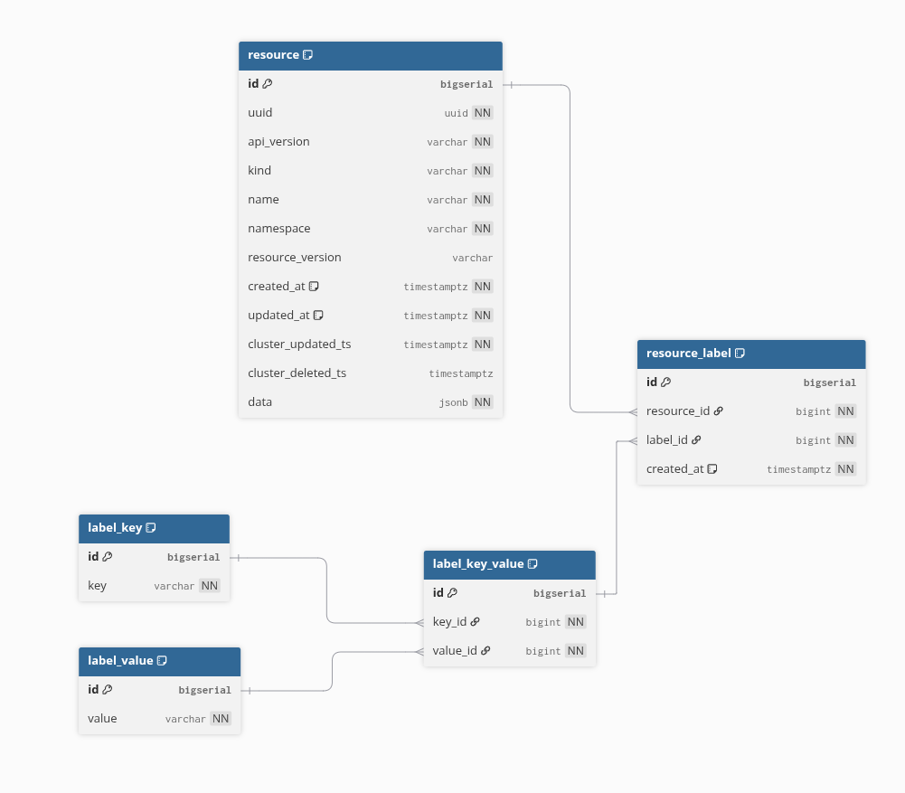

= PostgreSQL Label Filtering

== Overview

This page documents the PostgreSQL-specific implementation of label filtering
using normalized relational tables.

=== Motivation

The initial implementation stored Kubernetes resource labels exclusively in JSONB
fields within the `resource` table.
While JSONB provides flexibility and keeps the full resource manifest intact,
querying by labels using JSONB operations had severe performance limitations:

* **Query Performance**: Performance degraded significantly as the number of
  resources grew when label filters were applied that were not selective enough
* **Index Limitations**: GIN indexes on JSONB fields are less efficient for
  complex label selector queries with low selectivity
* **Query Complexity**: Multiple label conditions required expensive JSONB path
  operations for each row

To achieve better query performance for label selector queries, we implemented
a normalized relational schema that duplicates labels from JSONB into dedicated
indexed tables.

=== Design Goals

* Maintain backward compatibility - keep JSONB `data` field unchanged for full
  manifest storage
* Improve query performance for label selectors, especially those with low
  selectivity on large datasets
* Support all Kubernetes label selector operations: `exists`, `notexists`,
  `equals`, `notequals`, `in`, `notin`
* Avoid updating label tables when resource updates don't affect labels
  (e.g., status-only updates), preventing unnecessary table locking and write
  operations
* Avoid querying the database for previous resource state and deserializing it
  just to determine if label updates are needed
* Deduplicate label keys, values, and key-value pairs to minimize storage
  overhead
* Immutable label tables to prevent accidental modifications (UPDATE operations
  are revoked)
* Minimize timestamp overhead - only `resource_label` has `created_at` for
  troubleshooting

== Normalized Schema

The label normalization uses a 4-table design to minimize storage and maximize
query performance:

Key relationships:

* Each **resource** can have multiple **resource_label** entries (one per label)
* Each **resource_label** references one **label_key_value** (the key-value combination)
* Each **label_key_value** references one **label_key** and one **label_value**
* Keys, values, and pairs are deduplicated - stored once and reused across all
  resources

== Query Implementation

=== Interface Changes

The label filtering implementation required changes to the `DBFilter` interface
to support JOIN-based queries:

Previously, each label filter type was implemented as separate methods that
returned SQL expressions:
[source,go]
----
existsLabelFilter(cond sqlbuilder.Cond, labels []string) string
equalsLabelFilter(cond sqlbuilder.Cond, labels map[string]string) string
// ... etc
----

The new approach consolidates all label filtering into a single method:
[source,go]
----
ApplyLabelFilters(sb *sqlbuilder.SelectBuilder, labelFilters *models.LabelFilters)
----

**Rationale**: Label filtering with normalized tables requires correlated
subqueries that must be coordinated with the main query structure.
The consolidated method can:

* Apply EXISTS subqueries for positive label conditions
* Apply NOT EXISTS subqueries for negative label conditions
* Ensure deterministic parameter ordering across all filters

=== Query Strategy

All label filters use correlated `EXISTS` / `NOT EXISTS` subqueries.
Each filter is applied as an independent subquery, and multiple filters are
combined with `AND`.
This gives the query planner full optimization flexibility: it can reorder
conditions based on table statistics, short-circuit evaluation, and plan each
subquery independently.

=== Query Examples

==== Example 1: Single Exists Filter

**Label Selector**: `env` (select resources that have the label key `env`)

**Generated Query**:
[source,sql]
----
SELECT
    resource.data->'metadata'->>'creationTimestamp' AS created_at,
    resource.id,
    resource.uuid,
    resource.data
FROM resource
WHERE EXISTS (
    SELECT 1
    FROM resource_label rl
    JOIN label_key_value lkv ON lkv.id = rl.pair_id
    JOIN label_key lk ON lk.id = lkv.key_id
    WHERE rl.resource_id = resource.id
    AND lk.key = $1  <1>
)
----
<1> `$1 = 'env'` - Correlated EXISTS subquery checks for the label key

==== Example 2: Single Equals Filter

**Label Selector**: `env=prod` (select resources where label `env` equals `prod`)

**Generated Query**:
[source,sql]
----
SELECT
    resource.data->'metadata'->>'creationTimestamp' AS created_at,
    resource.id,
    resource.uuid,
    resource.data
FROM resource
WHERE EXISTS (
    SELECT 1
    FROM resource_label rl
    JOIN label_key_value lkv ON lkv.id = rl.pair_id
    JOIN label_key lk ON lk.id = lkv.key_id
    JOIN label_value lv ON lv.id = lkv.value_id
    WHERE rl.resource_id = resource.id
    AND lk.key = $1 AND lv.value = $2  <1>
)
----
<1> `$1 = 'env'`, `$2 = 'prod'` - Correlated EXISTS subquery checks for the
  key-value pair

==== Example 3: Single In Filter

**Label Selector**: `env in (prod, stage)` (select resources where label `env`
is either `prod` or `stage`)

**Generated Query**:
[source,sql]
----
SELECT
    resource.data->'metadata'->>'creationTimestamp' AS created_at,
    resource.id,
    resource.uuid,
    resource.data
FROM resource
WHERE EXISTS (
    SELECT 1
    FROM resource_label rl
    JOIN label_key_value lkv ON lkv.id = rl.pair_id
    JOIN label_key lk ON lk.id = lkv.key_id
    JOIN label_value lv ON lv.id = lkv.value_id
    WHERE rl.resource_id = resource.id
    AND lk.key = $1 AND lv.value IN ($2, $3)  <1>
)
----
<1> `$1 = 'env'`, `$2 = 'prod'`, `$3 = 'stage'` - Correlated EXISTS subquery
  checks for the key with any of the specified values

==== Example 4: Single NotExists Filter

**Label Selector**: `!env` (select resources that do NOT have the label key `env`)

**Generated Query**:
[source,sql]
----
SELECT
    resource.data->'metadata'->>'creationTimestamp' AS created_at,
    resource.id,
    resource.uuid,
    resource.data
FROM resource
WHERE NOT EXISTS (
    SELECT 1
    FROM resource_label rl
    JOIN label_key_value lkv ON lkv.id = rl.pair_id
    JOIN label_key lk ON lk.id = lkv.key_id
    WHERE rl.resource_id = resource.id
    AND lk.key IN ($1)  <1>
)
----
<1> `$1 = 'env'` - Exclude resources that have this label key

**Logic**: Use NOT EXISTS subquery to exclude resources that have the label key

==== Example 5: Single NotEquals Filter

**Label Selector**: `env!=prod` (select resources where label `env` exists but
does NOT equal `prod`)

**Generated Query**:
[source,sql]
----
SELECT
    resource.data->'metadata'->>'creationTimestamp' AS created_at,
    resource.id,
    resource.uuid,
    resource.data
FROM resource
WHERE NOT EXISTS (
    SELECT 1
    FROM resource_label rl
    JOIN label_key_value lkv ON lkv.id = rl.pair_id
    JOIN label_key lk ON lk.id = lkv.key_id
    JOIN label_value lv ON lv.id = lkv.value_id
    WHERE rl.resource_id = resource.id
    AND (lk.key = $1 AND lv.value = $2)  <1>
)
----
<1> `$1 = 'env'`, `$2 = 'prod'` - Exclude resources that have this specific
key-value pair

**Logic**: Use NOT EXISTS subquery to exclude resources that have the specific
key-value pair

==== Example 6: Single NotIn Filter

**Label Selector**: `env notin (prod, stage)` (select resources where label
`env` exists but is NOT `prod` or `stage`)

**Generated Query**:
[source,sql]
----
SELECT
    resource.data->'metadata'->>'creationTimestamp' AS created_at,
    resource.id,
    resource.uuid,
    resource.data
FROM resource
WHERE EXISTS (
    SELECT 1
    FROM resource_label rl
    JOIN label_key_value lkv ON lkv.id = rl.pair_id
    JOIN label_key lk ON lk.id = lkv.key_id
    WHERE rl.resource_id = resource.id
    AND lk.key IN ($1)  <1>
    GROUP BY rl.resource_id
    HAVING COUNT(DISTINCT lk.key) = 1
)
AND NOT EXISTS (
    SELECT 1
    FROM resource_label rl
    JOIN label_key_value lkv ON lkv.id = rl.pair_id
    JOIN label_key lk ON lk.id = lkv.key_id
    JOIN label_value lv ON lv.id = lkv.value_id
    WHERE rl.resource_id = resource.id
    AND (lk.key = $2 AND lv.value IN ($3, $4))  <2>
)
----
<1> `$1 = 'env'` - Ensure the key exists
<2> `$2 = 'env'`, `$3 = 'prod'`, `$4 = 'stage'` - Ensure none of the forbidden
values are present

**Logic**:
* First EXISTS ensures the key exists
* Second NOT EXISTS ensures none of the forbidden values are present

==== Example 7: Two Equals Filters

**Label Selector**: `app=frontend,env=prod` (select resources where label `app`
equals `frontend` AND label `env` equals `prod`)

**Generated Query**:
[source,sql]
----
SELECT
    resource.data->'metadata'->>'creationTimestamp' AS created_at,
    resource.id,
    resource.uuid,
    resource.data
FROM resource
WHERE EXISTS (
    SELECT 1
    FROM resource_label rl
    JOIN label_key_value lkv ON lkv.id = rl.pair_id
    JOIN label_key lk ON lk.id = lkv.key_id
    JOIN label_value lv ON lv.id = lkv.value_id
    WHERE rl.resource_id = resource.id
    AND lk.key = $1 AND lv.value = $2  <1>
)
AND EXISTS (
    SELECT 1
    FROM resource_label rl
    JOIN label_key_value lkv ON lkv.id = rl.pair_id
    JOIN label_key lk ON lk.id = lkv.key_id
    JOIN label_value lv ON lv.id = lkv.value_id
    WHERE rl.resource_id = resource.id
    AND lk.key = $3 AND lv.value = $4  <2>
)
----
<1> `$1 = 'app'`, `$2 = 'frontend'` - EXISTS subquery for app=frontend
<2> `$3 = 'env'`, `$4 = 'prod'` - EXISTS subquery for env=prod

**Logic**: Each key-value pair gets its own independent EXISTS subquery.
Multiple subqueries are combined with AND to enforce all conditions.

==== Example 8: Combined Filters (Positive and Negative)

**Label Selector**: `env in (prod, stage), app=frontend, !debug`

This selector combines multiple filter types:
* `app=frontend` - Equals filter (positive)
* `env in (prod, stage)` - In filter (positive)
* `!debug` - NotExists filter (negative)

**Generated Query**:
[source,sql]
----
SELECT
    resource.data->'metadata'->>'creationTimestamp' AS created_at,
    resource.id,
    resource.uuid,
    resource.data
FROM resource
WHERE EXISTS (
    SELECT 1
    FROM resource_label rl
    JOIN label_key_value lkv ON lkv.id = rl.pair_id
    JOIN label_key lk ON lk.id = lkv.key_id
    JOIN label_value lv ON lv.id = lkv.value_id
    WHERE rl.resource_id = resource.id
    AND lk.key = $1 AND lv.value = $2  <1>
)
AND EXISTS (
    SELECT 1
    FROM resource_label rl
    JOIN label_key_value lkv ON lkv.id = rl.pair_id
    JOIN label_key lk ON lk.id = lkv.key_id
    JOIN label_value lv ON lv.id = lkv.value_id
    WHERE rl.resource_id = resource.id
    AND lk.key = $3 AND lv.value IN ($4, $5)  <2>
)
AND NOT EXISTS (
    SELECT 1
    FROM resource_label rl
    JOIN label_key_value lkv ON lkv.id = rl.pair_id
    JOIN label_key lk ON lk.id = lkv.key_id
    WHERE rl.resource_id = resource.id
    AND lk.key IN ($6)  <3>
)
----
<1> `$1 = 'app'`, `$2 = 'frontend'` - EXISTS subquery for app=frontend
<2> `$3 = 'env'`, `$4 = 'prod'`, `$5 = 'stage'` - EXISTS subquery for env in
  (prod, stage)
<3> `$6 = 'debug'` - NOT EXISTS subquery excludes resources with debug label

**Logic**: All filters (positive and negative) use the same subquery pattern.
Each filter is an independent correlated subquery combined with AND.

== Write Path: Trigger Synchronization

Labels are automatically synchronized from JSONB to normalized tables using a
PostgreSQL trigger that fires on INSERT, UPDATE, or DELETE operations on the
`resource` table.

=== Trigger Logic

The trigger handles three operations:

**INSERT**::
* Extracts labels from JSONB `data->'metadata'->'labels'` using set-based
  operations
* Uses CTEs (Common Table Expressions) to batch-insert new keys, values, and
  pairs
* Inserts new keys and values if they don't exist (using ON CONFLICT DO NOTHING)
* Creates or reuses label pairs for key-value combinations
* Creates `resource_label` entries linking the resource to its label pairs
* All operations performed in a single efficient query using CTEs instead of
  loops

**UPDATE**::
* Optimization: Skips processing if labels haven't changed (90%+ of updates are
  status-only)
* Deletes all existing `resource_label` entries for the resource
* Re-inserts `resource_label` entries based on updated labels using the same
  CTE-based approach
* More efficient than computing diffs for label changes

When a resource is deleted, the `resource_label` entries are automatically
removed via the `ON DELETE CASCADE` foreign key constraint on
`resource_label.resource_id`.
The trigger does not handle DELETE operations.
Entries in `label_key`, `label_value`, and `label_key_value` tables are not removed
when resources are deleted, allowing reuse across resources.

=== Update Optimization

The trigger checks if labels have changed before processing.
This optimization is critical because most resource updates only change the
`status` field, not labels.
Skipping trigger logic for unchanged labels significantly reduces write overhead
and prevents unnecessary table locking.

