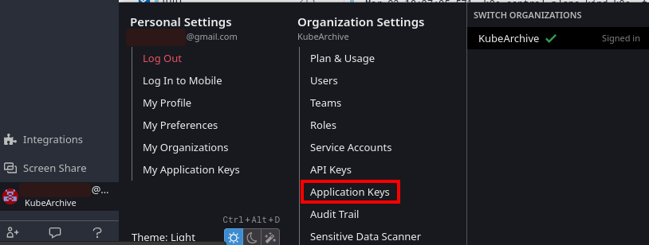

## Datadog

1. Create a free 14-days Datadog account at [datadoghq.com](https://www.datadoghq.com/free-datadog-trial/#)
    * Select the proper region. The following examples uses `EU` for the region.
1. In the stack select `Kubernetes`
1. Install the Datadog operator:
    ```bash
    kubectl create ns datadog
    helm repo add datadog https://helm.datadoghq.com
    helm install datadog-operator datadog/datadog-operator -n datadog
    kubectl create secret generic datadog-secret --from-literal api-key=<apikey> -n datadog
    ```
   *NOTE*: Use the API Key provided in the instructions.
1. Deploy the Agent
    ```bash
    kubectl apply -f integrations/logging/datadog/datadog-agent.yaml
    ```
1. Run the cronjob logs generator
    ```bash
    bash ./test/log-generators/cronjob/install.sh
    ```
1. [Optional] Access the [UI logs section](https://app.datadoghq.eu/logs) to check if the logs reached datadog backend
1. [Optional] Fill the box with the proper filter based on the pod name and the container name:
    ```
    pod_name:generate-log-1-29017047-fl7zd container_name:generate
    ```

1. Go to Application Key in the UI (Click on top of the user in the bottom left corner of the UI)


1. Add a new Application Key

1. Copy and set the `APP_KEY`
    ```bash
    APP_KEY=<APP_KEY>
    ```

1. Set the `API_KEY` available in the `datadog-secret`
    ```bash
    API_KEY=`kubectl -n datadog-operator get secret datadog-secret -o jsonpath='{.data.api-key}' | base64 --decode`
    ```

1. Retrieve the logs with a `curl` command and process them with `jq`.
    More information of the endpoint [here](https://docs.datadoghq.com/es/api/latest/logs/?code-lang=curl#search-logs-post).
    ```bash
    curl -X POST "https://api.datadoghq.eu/api/v2/logs/events/search" -H "Content-Type: application/json" -H "DD-API-KEY: ${API_KEY}" -H "DD-APPLICATION-KEY: ${APP_KEY}" \
   -d '{"filter":{"from":<from-ts>,"to":<to-ts>,"query":"pod_name:<pod-name> container_name:generate"}}' | jq '.data[] | .attributes.message'
    ```

