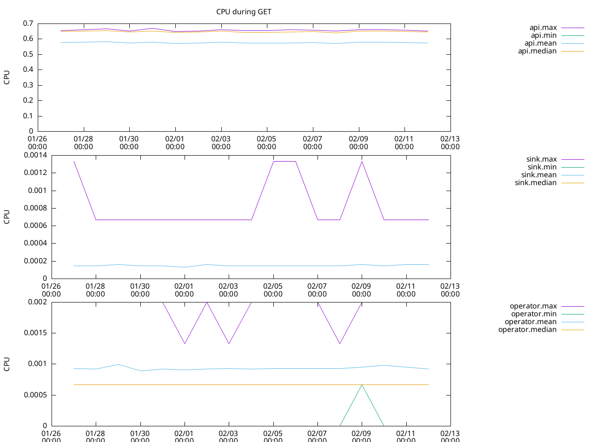
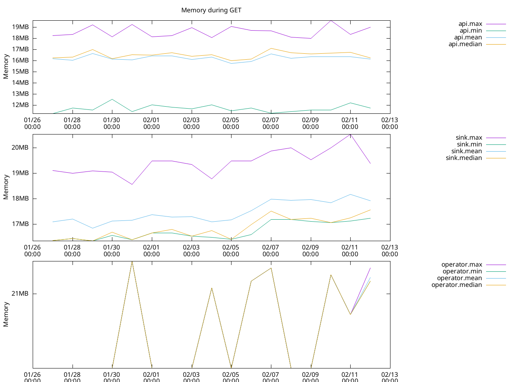
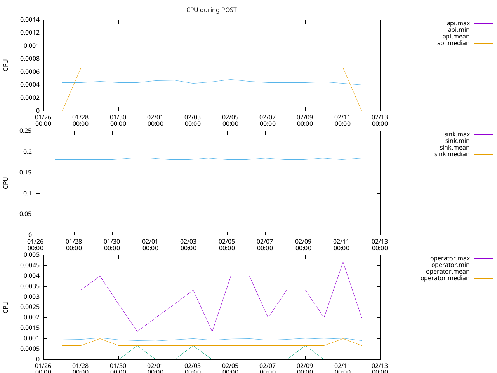
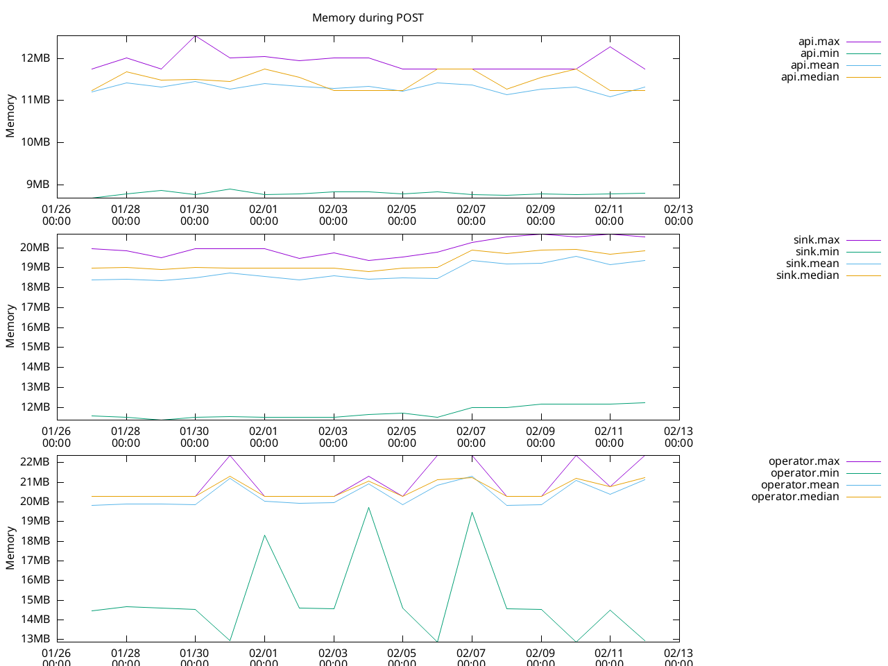

# Performance Tests

## Running tests

To run the performance tests, execute the following from the root of the repository:

```bash
kind create cluster
bash hack/quick-install.sh
bash test/performance/run.sh
```

**Note**: this requires at least Python 3.10

The tests are run with [Locust](https://docs.locust.io/en/stable/) in order, and they
are the following:

1. `create`: (Sink) POST / to create Pods from a template, aprox ~3k Pods are inserted
1. `get`: (API) GET /api/v1/pods with various query patterns including:
   - Basic pod retrieval
   - Timestamp filtering with `creationTimestampAfter`
   - Timestamp filtering with `creationTimestampBefore`
   - Timestamp range filtering with both parameters

The results of the tests are on `./perf-results/`, relative to the root of the repository.
Their name reference the test where they come from, currently `get-*.csv` and `create-*.csv`

-   `.txt` files contain summaries of Locust, the time unit is milliseconds.
-   `.csv` files contain values from Prometheus, the CPU unit is in milliCPU, the memory unit is bytes.

## Merging results from GitHub Workflows

This process merges test results from GitHub Workflows from the last 90 days so each
GH Workflow represents a day. Minimum, maximum, mean and median are computed for each
day and stored in different CSV files within the `merge` folder (`merge/*.csv`). The script
needs a token with the following permissions:

* Actions: Read-Only

```bash
export GH_TOKEN="a personal github token"
bash test/performance/merge.sh
```

The script itself writes CSV files and prints them to standard output, which is not very useful for human
interaction. We offer `gnuplot` files to plot the data gathered by the merge process. Install [GNU plot](http://www.gnuplot.info/)
using your usual package manager and run the following commands.

```
gnuplot -e "name='Memory during GET'; filename='merge/get-memory.csv'; outfile='get-memory.png'" test/performance/memory.gnuplot
gnuplot -e "name='Memory during POST'; filename='merge/create-memory.csv'; outfile='create-memory.png'" test/performance/memory.gnuplot
gnuplot -e "name='CPU during GET'; filename='merge/get-cpu.csv'; outfile='get-cpu.png'" test/performance/cpu.gnuplot
gnuplot -e "name='CPU during POST'; filename='merge/create-cpu.csv'; outfile='create-cpu.png'" test/performance/cpu.gnuplot
```

This will create four PNGs in the root of the repository. Results may vary but you should see
something similar to:





